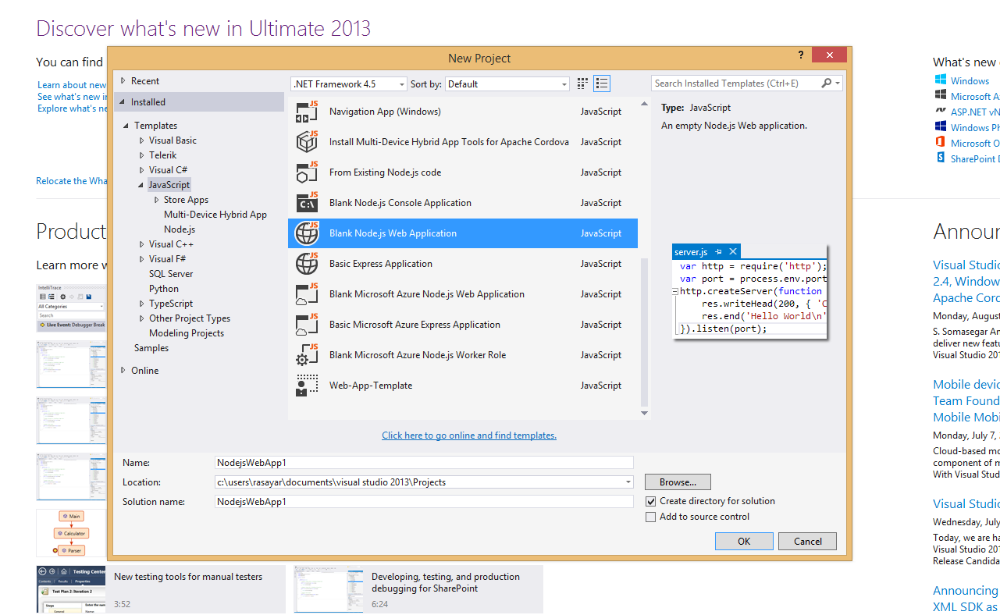
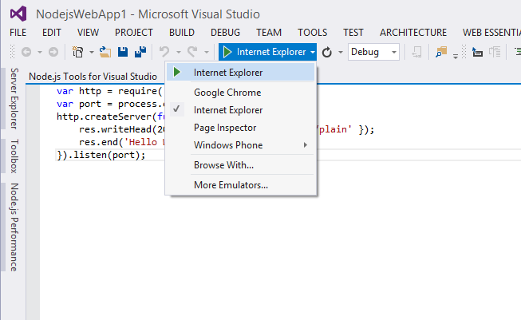
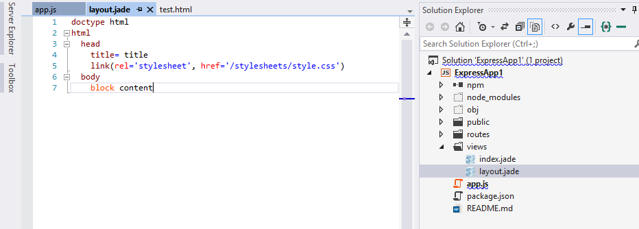
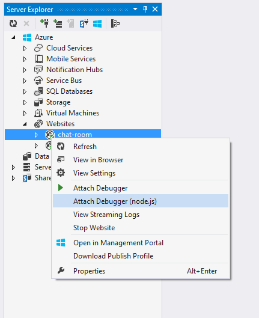

Part 1 - Introduction to Node.js
================================

What is node.js? Why node.js?
-----------------------------

[Node.js](http://nodejs.org) is a runtime environment and library for
running JavaScript applications outside the browser. Node.js is mostly
used to run real-time server applications and shines through its
performance using non-blocking I/O and asynchronous events. A complete
web ecosystem has been built around node.js with several web app
frameworks and protocol implementations available for usage. It’s
definitely one of the easiest and fastest way to develop real-time
applications on the web today.

Why use node.js? One word answer: JavaScript. JavaScript is an extremely
popular language and is credited with being one of the driving forces
that turned the web into the dynamic wonderland that it is today. What
you can do in a browser nowadays, rivals all others!

JavaScript arose on the frontend but - thanks to the V8 JavaScript
engine and the work of Ryan Dahl - you can now run networked JavaScript
applications outside of the browser precisely to build web apps. Node.js
lets you unify the programming language used by your app - no longer do
you need a different language for your backend, you can use JavaScript
throughout. If your background is in building and design websites and
web app frontends in HTML, CSS and JavaScript, you don’t need to pick up
another language to develop complex data-driven back-ends for your apps.

Node.js plays a critical role in the advancement of WebSockets as a
method for real-time communication between the front and back ends. The
use of WebSockets and the libraries building on that protocol such as
Socket.IO have really pushed what is expected of web applications and
lets us developers explore new ways to create the web.

Setting up node.js on Windows 8
-------------------------------

To get started, you will need a reasonably up to date machine, I will be
showing you how to install Node.js on Windows 8.1.

Firstly, you will need to download and install the node.js runtime. You
can download the current version 0.10.30 (as of this writing) here:
[http://nodejs.org/download/](http://nodejs.org/download/). Choosing the
Windows Installer is one of the easiest ways to get started.

Alternatively, if you’re a fan of [Chocolatey](http://chocolatey.org/),
the package manager for Windows, you can install node by running:

`choco install nodejs.install`

You should double check that the node executable has been added to your
PATH system environment variable. [Watch this
video](https://www.youtube.com/watch?v=W9pg2FHeoq8), if you want to see
how to change your environment variables on Windows 8 and Windows 8.1.
You will want to make sure the following folder has been added to the
PATH variable:

`C:\Program Files (x86)\nodejs\`

If you go to your Command Prompt and type in node –h, you should see the
help documentation for the node executable displayed.

Along with Node.js, [NPM](https://www.npmjs.org/), the system used to
manage node packages, should be installed and available on the Command
Prompt as well. Simply type in npm –h, you should see the help
documentation for NPM displayed.

If you encounter an error similar to this one:

`Error: ENOENT, stat 'C:\Users\someuser\AppData\Roaming\npm'`

The resolution is to create a folder at the path specified above, as
shown in this
[StackOverflow](http://stackoverflow.com/questions/25093276/nodejs-windows-error-enoent-stat-c-users-rt-appdata-roaming-npm)
question. This is only an issue in the latest node.js installer and
should be resolved by next release. You can create the folder like so:

`mkdir -r C:\Users\someuser\AppData\Roaming\npm`

Why use Visual Studio 2013? Node Tools for Visual Studio!
---------------------------------------------------------

With Node.js installed, it’s time to select a development tool. Of
course, you are free to use any editing tool you want but why use a
glorified notepad when you can experience the full power of
enterprise-grade integrated development environments like [Visual
Studio](http://www.visualstudio.com/). **You get it for free to boot!**

Now what’s cool about Node Tools for Visual Studio is that is adds
Node.js support for editing, Intellisense, performance profiling, npm,
TypeScript, Debugging locally and remotely (including on
Windows/MacOS/Linux), as well Azure Web Sites and Cloud Service.

Throughout these tutorials, I will be using Visual Studio 2013 to
develop, debug and deploy node, you are welcome to use any
development tool you wish. If you want to use Visual Studio, You can
download any of the following editions of Visual Studio and then install
the free [Node Tools for Visual
Studio](http://nodejstools.codeplex.com/releases/view/119433).

-   **[THIS ONE IS FREE]** Visual Studio 2013 Community Edition. [Download
    here](https://www.visualstudio.com/en-us/news/vs2013-community-vs.aspx).

-   Visual Studio 2013 Pro or higher (requires Update 2)

-   Visual Studio 2012 Pro or higher (requires Update 4)

Don’t forget to install the free [Node Tools for Visual
Studio](http://nodejstools.codeplex.com/releases/view/119433).

Starting a new node.js project in Visual Studio
-----------------------------------------------

*Note: Screenshots show Visual Studio 2013 Ultimate.*

Starting a new node.js project is fairly straight forward.

1.  You want to boot Visual Studio and go to the File > New > Project
    menu item.


2.  You will want to go to Installed > Templates > JavaScript menu
    item on the left and select Blank Node.js Web Application on the
    right. Choose a location and name for your project and press OK.



3.  You will be presented with the following screen, feel free to
    explore Visual Studio at this point. You will want to open the
    generated server.js file in the Solution Explorer (on the right
    typically but may be located elsewhere on your screen.)


4.  You can now debug your node web application in your preferred
    browser.



Hello World in Node.js
----------------------

As is typical in other languages, the generated code example shows you
how to output “Hello World” in the browser. Let me explain how the
generated code in server.js works line by line. **Note: As stated in
this tutorial series description, I am assuming you have a knowledge of
JavaScript, HTML5 and how HTTP/the Internet work.*

**Line 1**

```node
var http = require('http');
```

Node.js has a simple module and dependencies loading system. You simply
call the function “require” with the path of the file or directory
containing the module you would like to load at which point a variable
is returned containing all the exported functions of that module.

**Line 2**

```node
var port = process.env.port || 1337;
```

On this line, we want to determine on which port the HTTP server serving
the HTML should run. If a port number is specified in the environment
variables, we will use that one or we will simply use 1337.

**Line 3**

```node
http.createServer(function (req, res) {
```

We want to create a server to handle HTTP requests. We will also pass
the createServer function a function callback containing two parameters
to a handle each individual request and return a response. Take a look
at Michael Vollmer’s
[article](http://recurial.com/programming/understanding-callback-functions-in-javascript/)
if you’ve never encountered callback functions in JavaScript. The
request received is passed in the req parameter and the response is
expected to written to the res parameter.

**Line 4**

```node
res.writeHead(200, { 'Content-Type': 'text/plain' });
```

Any HTTP response requires a status-line and headers, to learn more
about HTTP headers and how they work check out this
[article](http://code.tutsplus.com/tutorials/http-headers-for-dummies--net-8039).
In this case, we want to return 200 OK as the status response and to
specify the content-type as plain text. We specify this by calling the
writeHead function on the response object.

**Line 5**

```node
res.end('Hello World\n');
```

Once we are done writing the response we want to call the end function.
We can also pass the final content through the end function, in this
case we want to send the string “Hello World” in plain text.

**Line 6**

```node
}).listen(port);
```

We close off the callback and call the function listen at the port we
defined earlier, this will start the server and start accepting requests
sent to the defined port.

To see the result, you can start debugging by pressing on the button
shown in the previous screenshot. You can see “Hello World” in the
browser.


Voila! You have now successfully run a node.js app on Windows 8.1 using
Visual Studio 2013.

Part 2 – Welcome to Express with Node.js and Azure
==================================================

What is Express?
----------------

Express is a minimal, open source and flexible node.js web app framework
designed to make developing websites, web apps and APIs much easier.

Why use Express?
----------------

Express helps you respond to requests with route support so that you may
write responses to specific URLs. Express allows you to support multiple
templating engines to simplify generating HTML.

You will want to make sure node.js is properly installed and ready, take
a look at Part 1.

Let’s Get Started
-----------------

Starting a new node.js project is fairly straight forward.

1.  You want to boot Visual Studio and go to the File > New > Project
    menu item.


2.  You will want to go to Installed > Templates > JavaScript menu
    item on the left and select Basic Windows Azure Express Application
    on the right. Choose a location and name for your project and press
    OK.


3.  A popup will appear notifying you that dependencies defined in
    package.json need to be installed using NPM the package manager.
    Take a look at an explanation of NPM
    [here](http://dailyjs.com/2012/05/03/windows-and-node-1/).


4.  A project will be generated that includes a file called app.js. We
    will start there.

Explanation of app.js
---------------------


**Lines 6 through 10**

Lines 6 through 10 load various modules including express, http and
path. What’s interesting is that we also load a module called routes
(which will be explained later) and a module in the routes folder called
user.

**Line 12**

On this line, we called the function express() which will create our app
this app will be used when we decide to create a HTTP Server and it will
be the object containing all the properties of our web application as
well as the mapping between the URL received in a request and the
function handling its response.

**Line 15 through 17**

On these lines, we set various configuration parameters such as what
port the server will run on (line 15) and in which directory the
template html files will be found (line 16). On line 17, we specify the
templating engine that we want to use, in this case
[Jade](http://jade-lang.com/). Jade is a popular templating engine that
makes writing HTML extremely easy and without the extraneous syntax
requirements of angle brackets (<>). You can change the templating
engine to simply return HTML as is and not do anything further by
replacing Line 17 with the following code:

`app.set('view engine', 'html');`

**Line 18 through 23**

On these lines, we set various configuration parameters. You can find
the meaning of each individual parameter by taking a look at the [API
documentation](http://expressjs.com/4x/api.html#express). The
explanation of these configuration parameters is not required for this
tutorial.

**Line 24 and 25**

These lines are interesting as it is where we specify middleware to
handle [Stylus](http://learnboost.github.io/stylus/) CSS sheets and
HTML. Middleware is a layer that is automatically inserted into the
function calls between receiving the request and returning a response.
In this case, we are asking express to run the stylus middleware and the
static middleware for all requests in which the URL specific a path
inside the public folder of our project. We use to this server CSS and
JavaScript verbatim and not execute a request function for that URL.

**Line 27 through 30**

In these lines, we are specifying to express to handle errors if the
environment is set as development and not production. You don’t have to
worry about these lines.

**Line 32, 33**

In these lines, we are finally mapping a URL path in a HTTP request to a
specific function to handling the response. We will get back to this
shortly.

**Line 35 through 38**

In these lines, we create a HTTP server and specify the port, along with
a callback on success to say the server has been started.

Routing
-------

Routing and how to properly do routes is a controversial topic and there
is no correct answer. There are plenty of modules implementing routing
for Express and node.js, each with a different flavor and structure. We
will stick to the routing engine packaged with Express. In app.js, we
already specified the routing engine and we import the route modules
from the route directory. We added the routes in line 32-33. In other
words, we mapped the URL in the browser to the function on the server
that will respond to that request. Those functions that will handle the
requests are in the routes directory. Let’s take a look at index.js.

```node
exports.index = function(req, res){
  res.render('index', { title: 'Express' });
};
```

It’s just three lines but those three lines do a ton of work. Line 1
adds a function called index to the exports variable. The exports
variable is created by Node.js every time a module is loaded to allow
you to pass functions and variables to other modules, in this case, the
app.js module.

The function index takes two parameters, req and res. If you recall from Part 1 the req parameter held the request received and the res parameter holds
a variable to which you write your response. In this case, we are
executing the render function in the response variable which takes two
parameters. The first is the parameter that specifies the view to use
(the view is a file in the views directory) and the extension of the
file is not required so index will make to index.jade. The second
parameter is an object containing data that can be inserted into the
jade template.

The Index Template
------------------

The index.jade template is a whole different language that will not be
explained in this tutorial. A knowledge of HTML is required for this
entire tutorial series and in this case you will notice that the jade
templating language maps almost always directly to HTML.


With the exception of the “block” and “extends” keywords, the other
keywords are signify exactly the same thing as in HTML. This template
will be converted by jade middleware we loaded into the following HTML.

```html
<!DOCTYPE html>
<html>
<head>
    <title>Express</title>
    <link rel="stylesheet" href="/stylesheets/style.css">
</head>
<body>
    <h1>Express</h1>
    <p>Welcome to Express</p>
</body>
</html>
```

You will notice that the H1 tag that was generated contains the value of
title that we passed previously in the render function. You will also
notice it was inserted into the p tag directly in line with the text.
You will also undoubtedly notice that the entire HTML generated includes
things not mapped in Jade. That is where the “extends” keyword comes in.
In this case, we chose to extend the layout.jade file.



You’ll notice that the “block content” reappears in both files, this is
used by jade to specify that this block of HTML goes here (in the
layout.jade file) and this is what it looks like (in the index.jade
file).

In the layout.jade file, you will notice a link to a style.css file
which seemingly does not exist in our initial project. This file is
generated from the style.styl code using the Stylus middleware as we set
it up in app.js

There you have it! How we go from app.js to a route defining the
response and to finally the view declaring what that response looks
like. If you choose to run the web app locally by clicking on the debug
button (you can choose a different browser by clicking the dropdown
button on the right).


When pressed, this will start a node.js server and open Internet
Explorer to the root URL.


Creating REST APIs with Express
--------------------------------

A REST API defines a set of URLs that developers can use to manipulate data or issue commands
from a client or browser using HTTP protocols such as GET and POST. Responses for REST APIs are
typically returned in JSON or XML data format. Express makes it very easy for us to create a typical
REST API. 

Let's say we had a data model (perhaps a model representing a dog) and you want JavaScript running
on the client side or in your browser to be able to get, create, read, update, delete dogs in your
database. A typical REST API will need expose to a set of URLs to be able to perform the above.

```
GET /api/dogs <- Gets dogs
GET /api/dogs/id <- Gets a specific dog by ID a.k.a. read
POST /api/dogs <- Creates a dog
PUT /api/dogs/id <- Updates a dog
DELETE /api/dogs/id <- Deletes a dog
```

In Express, when you define your routes, you can map it to a URL like above:

```node

var app = express();
app.get('/api/dogs', function (req, res) {
    res.json({message:'dogs dogs dogs'});
}
app.get('/api/dogs/:id', function (req, res) {
    console.log(req.param('id'));
    res.json({message:'dog'});
}
app.post('/api/dogs/', function (req, res) {
    res.json({message:'created dog'});
}
app.put('/api/dogs/:id', function (req, res) {
    console.log(req.param('id'));
    res.json({message:'update dog'});
}
app.delete('/api/dogs/:id', function (req, res) {
    console.log(req.param('id'));
    res.json({message:'deleted dog'});
}

By returning a response with `.json()`, Express will set the `Content-Type` to `application\json` and 
format your JavaScript object into valid JSON which your client-side can reinterpret as an object. 

That's all it takes to create a REST API with Express. 

Publishing to Azure (for those using Visual Studio)
---------------------------------------------------

Now that we’ve got an express-based node.js app working, let’s deploy it
to the cloud in a few clicks. You can deploy to any cloud that supports
node.js among them [Nodejitsu](https://www.nodejitsu.com/),
[Heroku](https://www.heroku.com/), [Engine
Yard](https://www.engineyard.com/). I will be using Microsoft Azure as I
can run a node.js website on there for free.

You can sign up for a free trial of Microsoft Azure
[here](http://azure.microsoft.com/en-us/pricing/free-trial/). You will
get $220 to spend on all Azure services. For the service we are using,
[Azure Websites](http://azure.microsoft.com/en-us/services/websites/),
you can actually run 10 websites without spending a dime.

1.  Once you’ve got your Azure account setup, we will go back to the IDE
    and right click on the express project and select the Publish item
    from the menu.


2.  The Publish menu item will open a wizard with a few options, you
    will want to select the target Microsoft Azure Websites.

3.  You will be asked to sign in at this step, please use the same
    Microsoft Account here as you did on the Azure sign up.

4.  You will want to press New to create a new Azure website or if you
    already have one created, you can simply select it from the
    dropdown.


5.  You will want to fill up the fields in the wizard (just like below),
    make sure to choose a unique site name and press Create.


6.  You will be faced with a pre-filled wizard with a **Publish** bottom
    at the button, press Publish


**YOU ARE DONE! YOU ARE NOW PUBLISHED TO THE AZURE CLOUD!**

Take a tour of the Azure Websites in the [Azure
portal](http://manage.windowsazure.com). You can watch a [video
here](http://channel9.msdn.com/Series/Windows-Azure-Web-Sites-Deep-Dive/01).

*Note: if you encounter errors publishing, be sure to place your project
closer to the root of the drive to avoid temporary copying errors.*


Part 3 – The Finale and Debugging Remote Node Apps!
===================================================

Deploying to Azure!
-------------------

Now that we’ve got our node.js app working, let’s
deploy it to the cloud in a few clicks. You can deploy to any cloud that
supports node.js. I will be using Microsoft Azure as I can run a node.js
website on there for free.

You can sign up for a free trial of Microsoft
Azure [here](http://azure.microsoft.com/en-us/pricing/free-trial/). You
will get $220 to spend on all Azure services. For the service we are
using, [Azure
Websites](http://azure.microsoft.com/en-us/services/websites/), you can
actually run 10 websites without spending a dime.

1.  Once you’ve got your Azure account setup, we will go back to the IDE
    and right click on the project and select the Publish item from the
    menu.


2.  The Publish menu item will open a wizard with a few options, you
    will want to select the target Microsoft Azure Websites.

3.  You will be asked to sign in at this step, please use the same
    Microsoft Account here as you did on the Azure sign up.

4.  You will want to press New to create a new Azure website or if you
    already have one created, you can simply select it from the
    dropdown.


5.  You will want to fill up the fields in the wizard (just like below),
    make sure to choose a unique site name and press Create.


6.  You will be faced with a pre-filled wizard with a **Publish** bottom
    at the button, press Publish


**WE HAVE DEPLOYED TO THE CLOUD BUT THE WORK IS NOT OVER YET!**

### Enabling WebSockets in Azure Websites

There is a few things you need to do to ensure that WebSockets is
enabled in your Website. If you want more detailed steps or FAQ, be sure
to [visit this
page](http://azure.microsoft.com/en-us/documentation/articles/web-sites-nodejs-chat-app-socketio/).

First, you will need to enable WebSockets from the azure command-line or
the Configuration tab, like so:


Second, you will want to modify your web.config file and the following
line to the system.webServer XML element.

`<webSocket enabled="false" />`

It may seem counterintuitive, but this disables the IIS WebSockets
module, which includes its own implementation of WebSockets and
conflicts with Node.js specific WebSockets modules such as Socket.IO.

Debugging Remote Node Apps
--------------------------

Node Tools for Visual Studio comes with several advanced debugging
features such as conditional breakpoints, “hit count” breakpoints,
tracepoints and remote debugging support for Windows, Linux and MacOSX.
Read more
[here](http://nodejstools.codeplex.com/wikipage?title=AdvancedDebugging).

### Connecting to Remote Node Instances

NTVS has special support for remote debugging of code running on Azure
Web Sites. Unlike simple remote debugging, the target machine is not
directly accessible over TCP, but NTVS comes with a WebSocket proxy for
the debugging protocol that exposes the debugger protocol via HTTP. When
you create a new Windows Azure project, the proxy is fully configured
for you in Web.Debug.config, and will be enabled on the web site if you
publish your project in the "Debug" configuration by following the next
couple of steps.

1.  Right click on the project and select the Publish item from the
    menu.


2.  Select the Settings tab on the left and be sure to choose the
    “Debug” configuration from the dropdown.



3.  Press Publish.

Once your project is properly deployed and web sockets are enabled, you
can attach to the web site from Server Explorer. If you do not have the
Server Explorer window open, you can open it via View → Server Explorer.
Then, locate your web site under Windows Azure → Web Sites, and
right-click on it. If it is running, and your project has been deployed
to it using the Debug configuration, you should see the "Attach Debugger
(Node.js)" command in the context menu.


### Reading Logs and Streaming Logs

If you want to stream the latest logs, it’s quite easy! All you have to
do is right click on your website in the Server Explorer and press View
Stream Logs


Conclusion
----------

Voila! There you have it!
